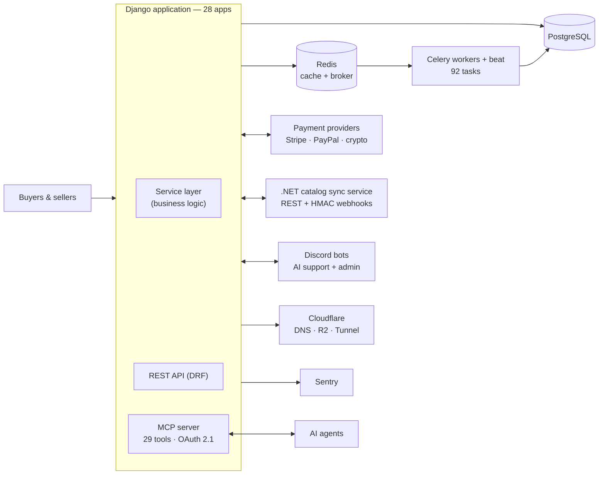

# StarShipDealers — Architecture

Case study of a peer-to-peer marketplace with escrow-protected payments that I
designed, built and operate on my own.

**Live:** [www.starshipdealers.com](https://www.starshipdealers.com) — in production since 1 November 2025
**Role:** sole designer, developer and operator
**Size:** 28 Django apps, ~200,000 lines of Python, ~4,000 tests, ~310 technical documents

> **No source code here.** The platform runs in production and moves real
> money, so the repository stays private. This document describes how it is
> built. Read access on request.

## The problem

People buy and sell virtual goods (ships, upgrades, paints, equipment) from
each other. The payment and the delivery happen in two different places: money
moves through a payment provider, the item moves inside a game account. The
buyer has to pay a stranger first and hope.

The platform sits in the middle: it holds the funds until the buyer confirms
delivery, verifies sellers, and pays them out automatically.

## Constraints that shaped the design

- **Money must be auditable.** Every movement is a ledger entry. Balances are
  not editable from the admin.
- **Delivery happens off-platform.** The state machine needs proof of delivery
  and an acceptance window rather than an automatic release.
- **Payment providers fail and retry.** Webhooks must be idempotent, and a
  missed webhook must not lose an order.
- **One operator.** Anything recurring is a Celery task, anything that can go
  wrong raises an alert, and support has to scale without a support team.

## Service map



Three services, three languages, one contract: REST over Bearer tokens for
calls, HMAC-signed webhooks for callbacks, health checks both ways.

## Order lifecycle

```
cart → order → payment → escrow → delivery with proof → acceptance (24h) → payout
```

- An order containing items from several sellers is **split into sub-orders**,
  one per seller, each with its own escrow and its own payout.
- **Prices are frozen at payment.** A catalog price change after checkout
  cannot alter what either side owes.
- Money is handled as **quantified `Decimal`**, never float, through an
  internal wallet (deposits, withdrawals, held balances) backed by a
  transaction ledger.
- **Payouts run hourly** with a 24-hour safety window after acceptance.
- Refunds take three routes — back through the payment provider, as wallet
  credit, or manually — and partial cancellation is supported.
- A dispute escalates the ticket and **freezes the payout** until it is
  resolved.

## Technical decisions

| Decision | Why | Trade-off |
|---|---|---|
| Service layer: business logic lives outside views and models | Money rules are tested without HTTP and reused by the API, the MCP server and Celery | More indirection than a classic Django app; worth it past a certain size |
| Provider-agnostic payment interface | Adding a provider means writing an adapter, not touching the order flow | The interface has to fit the weakest provider's feature set |
| Idempotent webhooks with three processing modes (synchronous, asynchronous audit, fully asynchronous) | A provider that retries cannot double-credit an account; slow handlers do not hold the connection | Each mode has to be reasoned about separately |
| Escrow as an explicit state machine with an acceptance window | Off-platform delivery cannot be verified automatically; the window bounds the dispute period | Buyers who never confirm need an automatic path |
| Fees computed by a rules engine (buyer escrow fee, seller commission, non-stacking promotional campaigns) | Pricing changes without a deploy | Rules stored in the database need their own tests |
| MCP server over OAuth 2.1 rather than a bespoke agent API | Standard auth, scopes and discovery; an audit log for every tool call | Young protocol, moving target |
| AI drafts, a human publishes | Support replies and content are prepared by an agent and validated before they reach anyone | Caps the automation gain on purpose |

## AI in the product

- **MCP server integrated into Django**: 29 tools behind OAuth 2.1
  (django-oauth-toolkit, read/write scopes, discovery), with an audit log. AI
  agents run day-to-day operations — catalog, content, support — under human
  approval.
- **Customer support**: a Claude agent answers first in private Discord
  tickets, in French or English depending on the member, and hands over the
  moment a human replies. In-app tickets get an AI-drafted reply that a human
  validates before sending.
- **Human approval pipeline**: content is staged, a moderator reacts ✅ in
  Discord, and publication goes through an HMAC-signed route.

## Security

- **Application security audit across 13 attack surfaces**, followed by
  hardening.
- **2FA on withdrawals** (TOTP / WebAuthn), fail-closed: no second factor, no
  withdrawal.
- **Signup risk scoring**: 11 signal collectors (network reputation,
  geolocation, client signals) producing an accept / audit / review / block
  decision.
- **7 account-creation paths mapped**, with 14 invariants covered by tests.
- Anti-spam: reCAPTCHA v3, disposable-domain blocking, MX validation and rate
  limiting.
- **Seller KYC**: two-step wizard, private storage, magic-byte validation.
  Phone verification through Twilio Verify.
- Content Security Policy with nonces, IP allow/deny lists, bot detection and
  IDOR protection.
- Secrets injected as environment variables; webhooks fail closed.

## Performance

- **Home page: 18 SQL queries down to 7 (-61%)**, through a centralized Redis
  cache with fragment-version invalidation. The p95 render time went from
  around 2 seconds to under 1.
- The same caching strategy removed 70 to 80% of the queries on the other
  critical pages, alongside N+1 elimination and 16 memory optimizations.

## Operations

- **DigitalOcean App Platform**, four Docker components: gunicorn web, Celery
  worker, Celery beat, collectstatic job.
- **Migrated from Railway with zero downtime**: platform-agnostic health
  checks, a written cutover plan and a rollback plan.
- PostgreSQL, Redis, Cloudflare (DNS, R2, Tunnel, Access, analytics), Sentry,
  uptime monitoring.
- Scripted local environment and a staging environment.
- Quality gates: ruff, mypy, djlint, pre-commit, coverage.
- Bot health checks every 60 seconds with anti-flap, a public live status page
  and a maintenance mode.

## In production

Figures as of 16 September 2026.

| | |
|---|---|
| Live since | 1 November 2025 |
| Accounts | 600+ |
| Orders | 170+ |
| Sellers | 12 |
| Listings | 586 |
| Median first support response | 17 min |
| Languages | English, French, Brazilian Portuguese |

Modest volumes, real payments, real users.

## Stack

`Python` `Django` `Django REST Framework` `Celery` `Redis` `PostgreSQL`
`Docker` `DigitalOcean` `Cloudflare` `Sentry` `HTMX` `Bootstrap 5`
`.NET 8 / C#` `discord.py` `pytest` `ruff` `mypy`

## Related

- [GoldenHive — Architecture](https://github.com/Meranhor/goldenhive-architecture)
- [NegotiNation — Architecture](https://github.com/Meranhor/negotination-architecture)
